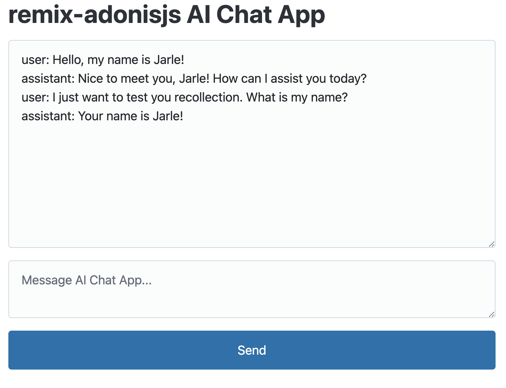

# Build an AI chat app with remix-adonisjs

In this guide we are going to build a very simple ChatGPT-clone that we can chat with.

Here is a screenshot of what we will build:



## Initial setup

First initialize a new remix-adonisjs project:

```sh
npm init adonisjs@latest -- -K="github:jarle/remix-starter-kit" --auth-guard=access_tokens --db=sqlite ai-tutorial
```

Before we do anything else, let's add some css to `resources/remix_app/root.tsx` so our application looks nice.
Add this snippet anywhere in the `<head>` tag of your `root.tsx` component:

```html
<link
  rel="stylesheet"
  href="https://cdn.jsdelivr.net/npm/@picocss/pico@2/css/pico.min.css"
/>
```

## Set up OpenAI service

Add a new environment variable to `#start/env.ts`
```
OPENAI_API_KEY: Env.schema.string(),
```

Head over to https://platform.openai.com/api-keys and create a new secret key to use their APIs.
This might require adding a payment method as their APIs are not available for free.

Put your new API key in the `.env` file in the root of your directory like this:
```
OPENAI_API_KEY=<your key>
```

Install the openai node library:
```
npm install openai
```


Create a new service for interacting with OpenAI

```
node ace make:service openai_service
```


Add some content to the service

```ts
// #services/openai_service.ts
import env from '#start/env'
import OpenAI from 'openai'

export type Message = {
  role: 'user' | 'assistant'
  content: string
}

export default class OpenAIService {
  private readonly openai: OpenAI

  constructor() {
    this.openai = new OpenAI({
      apiKey: env.get('OPENAI_API_KEY'),
    })
  }

  /**
   * Generate a completion by combining chat history with the latest user prompt
   * @param prompt The latest prompt
   * @param history Conversation history
   * @returns The generated completion
   */
  async getCompletion(prompt: string, history: Message[] = []) {
    const chatCompletion = await this.openai.chat.completions.create({
      messages: [
        ...history,
        {
          role: 'user',
          content: prompt,
        },
      ],
      model: 'gpt-3.5-turbo',
    })
    return chatCompletion.choices[0].message.content
  }
}
```

Instantiate the service inside `#services/_index.ts`:
```ts
// Register services that should be available in the container here
export const ServiceProviders = {
  hello_service: () => import('./hello_service.js'),
  openai: () => import('./openai_service.js'),
} satisfies Record<string, LazyService>
```

::: warning
Note that requests towards OpenAI are not free!
Read up on the [OpenAI API pricing](https://openai.com/pricing) if you are not familiar with it before proceeding with the guide.
:::

## Create the chat route

Create a new React Router route `/ai` with an action:
```
node ace remix:route --action ai
```

We will keep our conversation history in a server-side variable called `history` placed at the top of our route, and make the history available to the route component by exposing it through a loader:

```ts
let history: Message[] = []

export const loader = () => {
  return {
    history,
  }
}
```

This is not best practice since the variable is cleared on server restarts, but it works for our little demo.
Ideally we would have a database or some storage layer to keep our chat history in.

Access your service from the route action:

```ts
export const action = async ({ context }: ActionFunctionArgs) => {
  const { http, make } = context

  const { prompt } = http.request.only(['prompt'])
  // add user prompt to history
  history.push({
    role: 'user',
    content: prompt,
  })

  const openai = await make('openai')
  const completion = await openai.getCompletion(prompt, history)
  if (completion) {
    // add assistant completion to history
    history.push({
      role: 'assistant',
      content: completion,
    })
  }

  return Response.json(null)
}
```


Replace your `Page()` function with a form for creating completions with your action:

```tsx
import type { Message } from '#services/openai_service'
import { useFetcher, useLoaderData } from 'react-router'
import { useEffect, useRef } from 'react'

export default function Page() {
  const loaderData = useLoaderData<typeof loader>()
  const fetcher = useFetcher()

  let isMessaging = fetcher.state === 'submitting' && fetcher.formData?.get('_action') === 'message'
  let formRef = useRef<HTMLFormElement>(null)
  let inputRef = useRef<HTMLTextAreaElement>(null)
  let message = ''

  if (isMessaging) {
    message = `user: ${fetcher.formData?.get('prompt')?.toString()!!}\n`
  }

  useEffect(() => {
    if (isMessaging) {
      formRef.current?.reset()
    }
  }, [isMessaging])

  return (
    <div className="container">
      <h1>remix-adonisjs AI Chat App</h1>
      <textarea
        rows={10}
        readOnly
        value={loaderData.history.map((h) => `${h.role}: ${h.content}\n`).join('') + message}
      />
      <fetcher.Form method="post" ref={formRef}>
        <input hidden name="_action" readOnly value={'message'} />
        <textarea
          ref={inputRef}
          rows={2}
          name={'prompt'}
          required
          placeholder="Message AI Chat App..."
        />
        <button type="submit">Send</button>
      </fetcher.Form>
    </div>
  )
}
```


There is a lot going on in this route component!

Most of the logic comes from two things:
- We want to clear the form text area once the user sends a message
- We want to display the user message in the chat dialog box before a response has been received from the OpenAI API

If you look away from this logic, the loop is very simple:
1. Submit a form with a user message
1. Display the user message immediately in the chat dialog box
1. Append the user message to our `history` variable on the server
1. Get the assistant response from OpenAI and add it to the `history` variable
1. Return from the action, which will make React Router call the loader and display the updated history. Since we are already displaying the user message, the new assistant message is the only thing that changes on the page.
1. The loops starts again once the user submits a new message


## Conclusion

We have made a very simple AI service that can easily be extended.
Here are some suggestions for what to do next:

- Store chat messages in a database
- Stream chat responses

## Further reading

- [React Router Single: Clearing Inputs After Form Submissions](https://www.youtube.com/watch?v=bMLej7bg5Zo)
- [React Router Single: Optimistic UI](https://www.youtube.com/watch?v=EdB_nj01C80)
- [Documentation for the OpenAI Node.js library](https://github.com/openai/openai-node#readme)